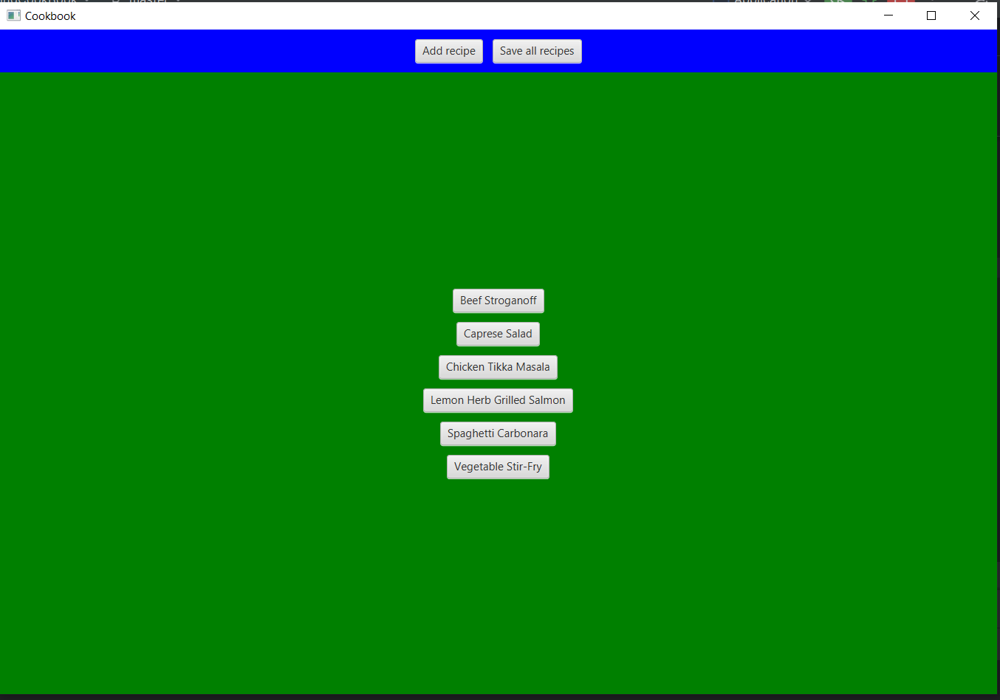
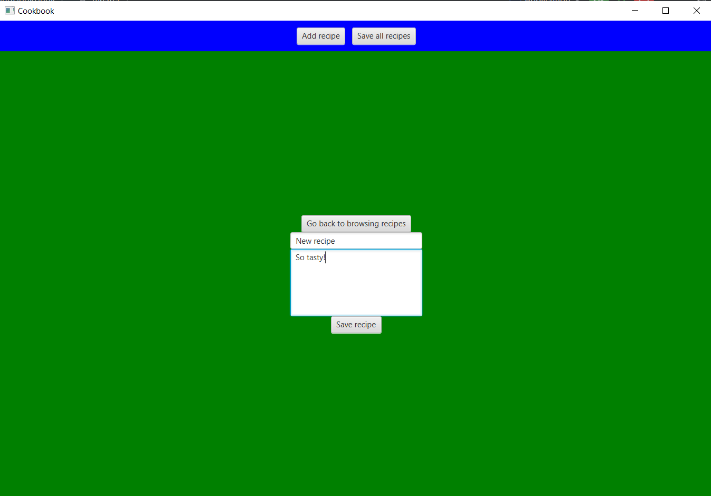
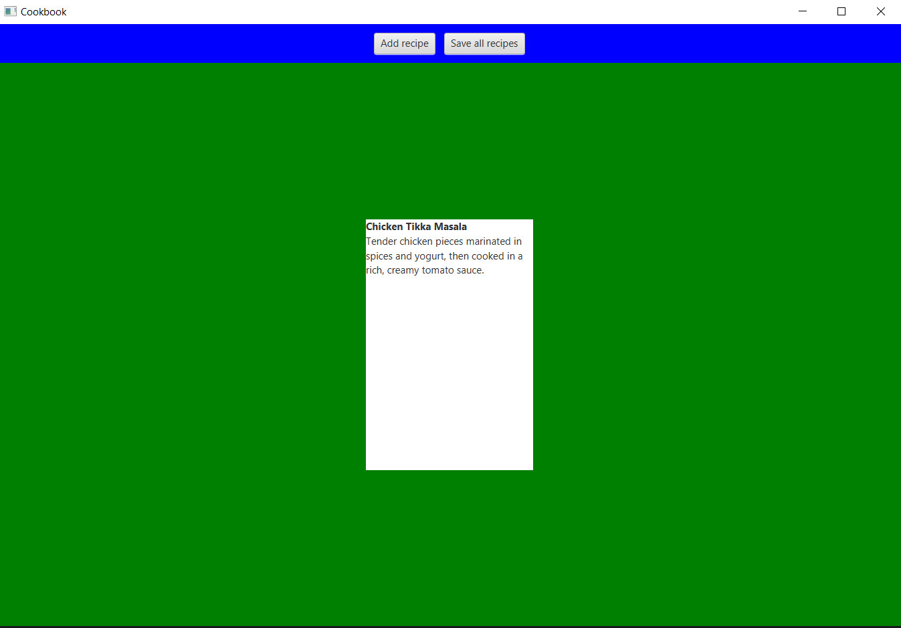

# "Cookbook": a desktop app for managing cooking recipes

## Требования:
### Функциональные:
создание рецепта:
- создание по названию и описанию.
- открытие существующего рецепта:
  - чтение описания в отдельном окне
  - хранение созданных рецептов
### Технические:
- требует не больше 2 гб оперативной памяти
- поддерживает работу с одним пользователем единовременно
- хранит файлы рецептов и настроек локально в одной директории

# Выбранные технологии
- JavaFx (удобное API, был опыт работы)

## Прогресс
### 1.5 часа
Создан репозиторий, загружено описание, подготовлена логика работы с рецептами, написано главное меню с кнопками добавления рецепта и фильтра (рецептов пока нет), подготовлены тесты для методов модели. Настроен CI (нужно запускать вручную через Actions).
### 3 часа
Приложение запускается со списком рецептов, при нажатии на рецепт открывается его описание
Поддерживает создание нового рецепта
Считывание рецептов из текстового файла и наоборот.
Добавлен скелет для последующего добавления ингредиентов в рецепты.
Приложение проходит тесты на базовый функционал.

## Скриншоты:
#### Меню выбора рецептов

#### Создание рецепта

#### Просмотр имеющегося рецепта

